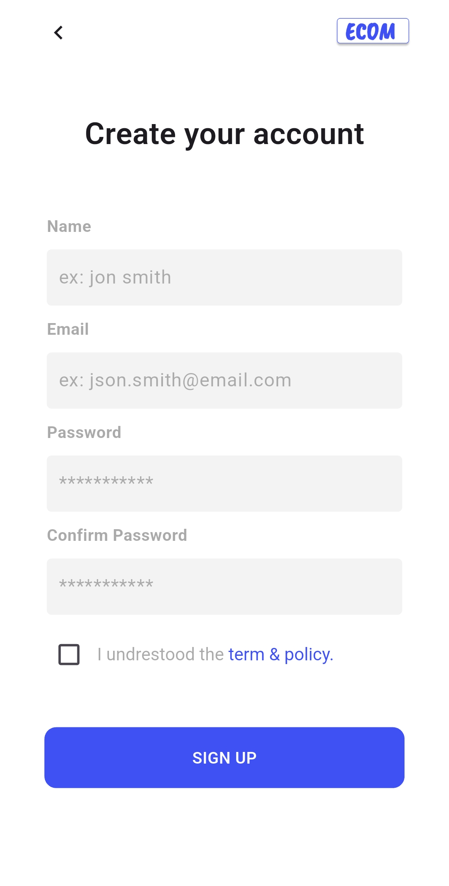

# Ecommerce App

# eCommerce App

This project is a robust, scalable eCommerce application developed using Flutter. The app was built with Clean Architecture principles to ensure maintainability, and Test-Driven Development (TDD) was applied to ensure its testability and reliability. Real-time chatting functionality was implemented using Socket.IO, allowing users to engage in instant communication during their shopping experience.

## Features
- **Real-Time Chat**: Integrated with Socket.IO for instant communication between users.
- **Scalable Architecture**: Clean Architecture principles applied to ensure the app’s scalability and ease of maintenance.
- **Test-Driven Development (TDD)**: The app was built using TDD to ensure high test coverage and maintainable code.
- **User-Friendly Interface**: A responsive and intuitive user interface, optimized for a seamless shopping experience.

## Tech Stack
- **Frontend**: Flutter
- **Backend**: Node.js with Socket.IO for real-time functionality
- **Architecture**: Clean Architecture
- **Development Methodology**: Test-Driven Development (TDD)

# Demo 
### Sign Up Product 

### Log in Page 

### Loading  

### Search Product 

### Detail Of Product 

### Home Page 

#### Add Product


## Getting Started

### Prerequisites
- Flutter SDK installed
- A code editor (e.g., Visual Studio Code, Android Studio)
- A running backend server for real-time chat (e.g., Socket.IO)


### Installation

1. Clone the repository:
   ```bash
   git clone https://github.com/your-username/ecommerce-app.git
    ```
2. Navigate into the project directory:
3. Install Dependencies
    ```bash
    flutter pub get
    ```
4. Run the app application
    ```bash
    flutter run
    ```

### About Clean Architecture
A Flutter application developed using clean architecture. This approach divides the development process into three independent layers:

- ### Domain:
  
    This is the heart of the application, responsible for executing core business logic and essential functionalities. 
    It ensures that the application's rules and operations are consistently applied, providing a solid foundation for the app's behavior.
- ### Data:
  
    This layer manages all data-related operations, including data fetching, storage, and manipulation. 
    It acts as a bridge between the domain layer and various data sources, ensuring seamless data flow and integrity.
- ### Presentation:

    This is the visual aspect of the application, focusing on the user interface and user experience. 
    It presents data to the users and handles user interactions, ensuring an engaging and intuitive interface.


## Advantage og Clean Arcitecture

By separating these concerns, the application maintains high cohesion within each layer while promoting low coupling between them, resulting in a clean, maintainable, and easily testable codebase.

- [Readmore...](https://resocoder.com/2019/08/27/flutter-tdd-clean-architecture-course-1-explanation-project-structure/)